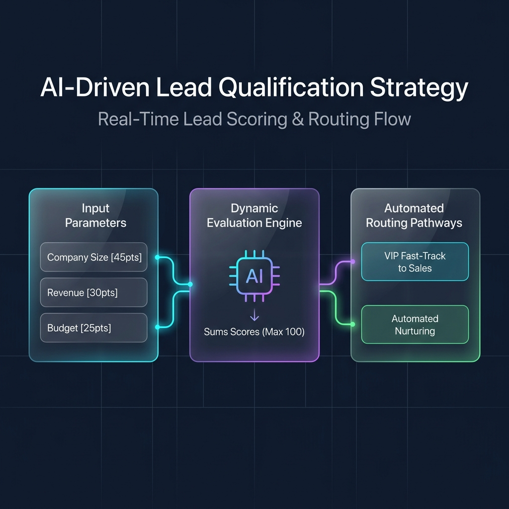
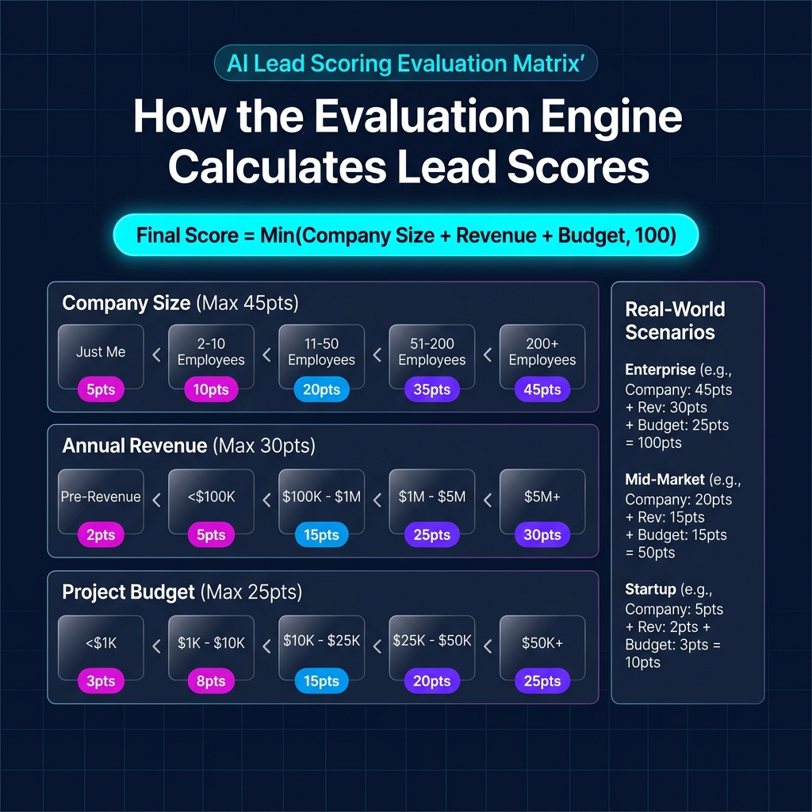

# Lead Scoring System

This document outlines the algorithm and weights used to automatically calculate lead scores for form submissions. The lead scoring mechanism is used to prioritize incoming leads, route them to appropriate channels, and identify high-value opportunities.

---

## Overview

The lead score ranges from **1 to 100**. It is calculated dynamically upon form submission based on three main criteria:

1. **Company Size** (Max 45 points)
2. **Annual Revenue** (Max 30 points)
3. **Project Budget** (Max 25 points)

The final score is capped at **100** using `Math.min(score, 100)`.

---

## 📽️ Business Presentation Deck

If you are presenting how this system works to business stakeholders, you can use the two presentation slides below:

### Slide 1: Inbound Lead-to-Routing Workflow
Shows how lead data dynamically flows through the scoring engine to route prospects to Sales or Automated Nurturing:



### Slide 2: Evaluation Scoring Matrix & Scenarios
Shows the exact math, point-weight distribution, and real-world calculation scenarios:



---

## Scoring Criteria & Weights

### 1. Company Size (Weight: Max 45 points)
Reflects the scale of the organization. Larger organizations are prioritized.

| Company Size Selection | Points Awarded |
| :--- | :---: |
| **Just me** | 5 |
| **2-10** | 15 |
| **11-50** | 25 |
| **51-200** | 35 |
| **200+** | 45 |

---

### 2. Annual Revenue (Weight: Max 30 points)
Reflects the financial capability and size of the lead's business.

| Annual Revenue Selection | Points Awarded |
| :--- | :---: |
| **Pre-revenue** | 2 |
| **<\$100K** | 5 |
| **\$100K-\$500K** | 10 |
| **\$500K-\$1M** | 15 |
| **\$1M-\$5M** | 25 |
| **\$5M+** | 30 |

---

### 3. Project Budget (Weight: Max 25 points)
Reflects the prospective value of the project opportunity.

| Project Budget Selection | Points Awarded |
| :--- | :---: |
| **<\$1K** | 3 |
| **\$1K-\$5K** | 8 |
| **\$5K-\$15K** | 15 |
| **\$15K-\$50K** | 20 |
| **\$50K+** | 25 |

---

## Capping Logic

The maximum score a lead can achieve is **100**. 
Even if the raw sum of points exceeds 100 (e.g., `45 (Company Size) + 30 (Revenue) + 25 (Budget) = 100`), the algorithm explicitly enforces a ceiling:
$$\text{Final Score} = \min(\text{Raw Score}, 100)$$

---

## Implementation Details

The lead score algorithm is implemented on the server in:
* **File:** [app/api/contact/route.ts](file:///e:/Antigravity/Automation-website/app/api/contact/route.ts#L30-L65)
* **Function:** `calculateLeadScore`

### Code Snippet

```typescript
function calculateLeadScore(data: Record<string, unknown>): number {
    let score = 0;

    // Company size weight
    const sizeScores: Record<string, number> = {
        "Just me": 5,
        "2-10": 15,
        "11-50": 25,
        "51-200": 35,
        "200+": 45,
    };
    score += sizeScores[data.companySize as string] || 0;

    // Revenue weight
    const revenueScores: Record<string, number> = {
        "Pre-revenue": 2,
        "<$100K": 5,
        "$100K-$500K": 10,
        "$500K-$1M": 15,
        "$1M-$5M": 25,
        "$5M+": 30,
    };
    score += revenueScores[data.annualRevenue as string] || 0;

    // Budget weight
    const budgetScores: Record<string, number> = {
        "<$1K": 3,
        "$1K-$5K": 8,
        "$5K-$15K": 15,
        "$15K-$50K": 20,
        "$50K+": 25,
    };
    score += budgetScores[data.projectBudget as string] || 0;

    return Math.min(score, 100);
}
```

---

## Example Scenarios

### Scenario A: Enterprise Lead
* **Company Size:** `200+` (45 points)
* **Annual Revenue:** `$5M+` (30 points)
* **Project Budget:** `$50K+` (25 points)
* **Calculation:** `45 + 30 + 25 = 100`
* **Final Lead Score:** **100**

### Scenario B: Mid-Market Growth Lead
* **Company Size:** `11-50` (25 points)
* **Annual Revenue:** `$100K-$500K` (10 points)
* **Project Budget:** `$5K-$15K` (15 points)
* **Calculation:** `25 + 10 + 15 = 50`
* **Final Lead Score:** **50**

### Scenario C: Early Stage / Individual Lead
* **Company Size:** `Just me` (5 points)
* **Annual Revenue:** `Pre-revenue` (2 points)
* **Project Budget:** `<$1K` (3 points)
* **Calculation:** `5 + 2 + 3 = 10`
* **Final Lead Score:** **10**
