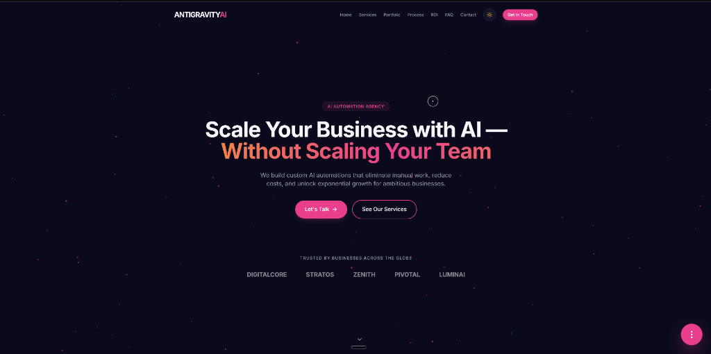

# 🌌 Antigravity AI — AI Automation Agency

> Scale Your Business with AI — Without Scaling Your Team. We build custom AI automations that eliminate manual work, reduce costs, and unlock exponential growth for ambitious businesses.

---

## 🖥️ Live Interface Preview

Below is a preview of the premium, dark-mode landing page designed for **Antigravity AI**:



---

## ✨ Features

- **Premium Modern Design**: Implements dark-mode glassmorphism, harmonious color palettes, subtle glowing micro-animations, and responsive layout architectures.
- **Dynamic Contact & Lead Capture**: Fully interactive contact form built with React Hook Form and Zod validation schemas.
- **Intelligent Lead Scoring**: Built-in backend lead qualification system that scores prospects automatically based on company size, role, website status, and message context.
- **Google Sheets Integration**: Seamless forwarding of lead scores and submission details to Google Apps Script.
- **Smooth Page Motion**: Integrated with Framer Motion and Lenis smooth scrolling for premium visual feedback.

---

## 🛠️ Tech Stack

- **Framework**: [Next.js 14 (App Router)](https://nextjs.org/)
- **Styling**: [Tailwind CSS](https://tailwindcss.com/) & PostCSS
- **Animation**: [Framer Motion](https://www.framer.com/motion/) & [Lenis Smooth Scroll](https://lenis.darkroom.engineering/)
- **Form Management**: [React Hook Form](https://react-hook-form.com/) & [Zod Validation](https://zod.dev/)
- **Programming Language**: [TypeScript](https://www.typescriptlang.org/)

---

## 🚀 Getting Started

### 1. Prerequisites
Ensure you have [Node.js](https://nodejs.org/) installed (version 18.x or later recommended).

### 2. Installation
Clone the repository and install the dependencies:

```bash
git clone https://github.com/Junaid7798/Automation-website.git
cd Automation-website
npm install
```

### 3. Environment Setup
Create a `.env.local` file in the root directory (refer to `.env.local` template):

```env
GOOGLE_SCRIPT_URL=your-google-script-url-here
RESEND_API_KEY=your-resend-api-key-here
```

### 4. Running the Development Server
Start the local server:

```bash
npm run dev
```

Open [http://localhost:3000](http://localhost:3000) in your browser to view the application.

---

## 📊 Lead Scoring System

Antigravity AI qualifies inbound leads dynamically. Points are calculated on submit using:
- **Company Size**: Higher scores for larger companies.
- **Job Role**: Prioritizes decision-makers (CEOs, Founders, CTOs, Operations Managers).
- **Online Presence**: Validates and analyzes company website.
- **Project Scope/Budget**: Gauges intent in description fields.

For the detailed formula and logic breakdown, please refer to our [Lead Score Documentation](Lead-Score.md).

---

## 📦 Building for Production

To create an optimized production build:

```bash
npm run build
npm run start
```
